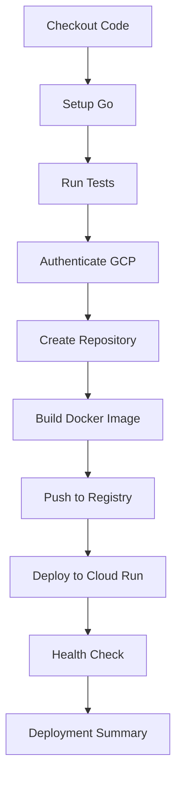

# Go API with GitHub Actions GCP Deployment

A simple Go REST API built with Gin framework that demonstrates automated deployment to Google Cloud Run using GitHub Actions.

## 🚀 Features

- **Simple REST API** with Gin framework
- **Automated CI/CD** with GitHub Actions
- **Containerized deployment** to Google Cloud Run
- **Manual workflow trigger** with branch selection
- **Multi-environment support** (staging/production)
- **Health check endpoints** for monitoring

## 📋 API Endpoints

| Method | Endpoint | Description |
|--------|----------|-------------|
| GET | `/` | Hello World message |
| GET | `/ip` | Returns client IP address |

## 🛠 Local Development

### Prerequisites
- Go 1.23 or higher
- Docker (optional)

### Running Locally

1. **Clone the repository:**
```bash
git clone https://github.com/paranietharan/cloud-workflow-api.git
cd cloud-workflow-api
```

2. **Install dependencies:**
```bash
go mod download
```

3. **Run the application:**
```bash
go run main.go
```

4. **Test the API:**
```bash
curl http://localhost:8080
curl http://localhost:8080/ip\
```

### Docker Development

1. **Build the Docker image:**
```bash
docker build -t go-api .
```

2. **Run the container:**
```bash
docker run -p 8080:8080 go-api
```

## ☁️ Cloud Deployment Setup

This project uses GitHub Actions to automatically deploy to Google Cloud Run. Follow these steps to set up automated deployment:

### 1. Google Cloud Setup

**Enable Required APIs:**
```bash
export PROJECT_ID="your-gcp-project-id"

gcloud services enable containerregistry.googleapis.com
gcloud services enable run.googleapis.com
gcloud services enable iamcredentials.googleapis.com
gcloud services enable artifactregistry.googleapis.com
```

**Create Service Account:**
```bash
# Create service account
gcloud iam service-accounts create github-actions \
    --description="Service account for GitHub Actions" \
    --display-name="GitHub Actions"

# Grant necessary permissions
gcloud projects add-iam-policy-binding $PROJECT_ID \
    --member="serviceAccount:github-actions@$PROJECT_ID.iam.gserviceaccount.com" \
    --role="roles/run.admin"

gcloud projects add-iam-policy-binding $PROJECT_ID \
    --member="serviceAccount:github-actions@$PROJECT_ID.iam.gserviceaccount.com" \
    --role="roles/artifactregistry.repoAdmin"

gcloud projects add-iam-policy-binding $PROJECT_ID \
    --member="serviceAccount:github-actions@$PROJECT_ID.iam.gserviceaccount.com" \
    --role="roles/iam.serviceAccountUser"
```

**Create Artifact Registry Repository:**
```bash
gcloud artifacts repositories create cloud-workflow-api \
    --repository-format=docker \
    --location=us-central1 \
    --description="Docker repository for Go API"
```

**Generate Service Account Key:**
```bash
gcloud iam service-accounts keys create key.json \
    --iam-account=github-actions@$PROJECT_ID.iam.gserviceaccount.com

# Copy the contents of key.json for GitHub secrets
cat key.json
```

### 2. GitHub Secrets Setup

Go to your GitHub repository → **Settings** → **Secrets and variables** → **Actions**

Add these repository secrets:

| Secret Name | Value | Description |
|-------------|-------|-------------|
| `GCP_PROJECT_ID` | `your-gcp-project-id` | Your Google Cloud Project ID |
| `GCP_SA_KEY` | `{entire key.json content}` | Service account key JSON |

### 3. Workflow Configuration

The GitHub Actions workflow is located at `.github/workflows/deploy-to-gcp.yml` and includes:

- **Manual trigger only** - Deploy when you want, from any branch
- **Environment selection** - Choose staging or production
- **Automated testing** - Runs tests before deployment
- **Container building** - Builds and pushes to Artifact Registry
- **Cloud Run deployment** - Deploys with proper configuration
- **Health checks** - Verifies deployment success

## 🔄 Deployment Process

### Manual Deployment

1. Go to your GitHub repository
2. Click **Actions** tab
3. Select **"Deploy Go API to GCP"** workflow
4. Click **"Run workflow"**
5. Choose:
   - Branch to deploy
   - Environment (staging/production)
6. Click **"Run workflow"**

### Workflow Steps



### Resource Limits

Current Cloud Run configuration:
- **Memory**: 512Mi
- **CPU**: 1 core
- **Timeout**: 3600 seconds
- **Concurrency**: Auto
- **Min instances**: 0
- **Max instances**: 10

**Container Won't Start:**
```go
// Make sure to bind to all interfaces
router.Run(":" + port)  // ✅ Correct
router.Run("localhost:8080")  // ❌ Wrong
```

**Permission Denied:**
```bash
# Ensure all required roles are assigned
gcloud projects get-iam-policy $PROJECT_ID
```

**Repository Not Found:**
```bash
# Create the Artifact Registry repository
gcloud artifacts repositories create cloud-workflow-api \
    --repository-format=docker \
    --location=us-central1
```

### Viewing Logs

```bash
# View application logs
gcloud logging read "resource.type=cloud_run_revision AND resource.labels.service_name=go-api" \
    --limit=50 \
    --format="table(timestamp,severity,textPayload)"
```